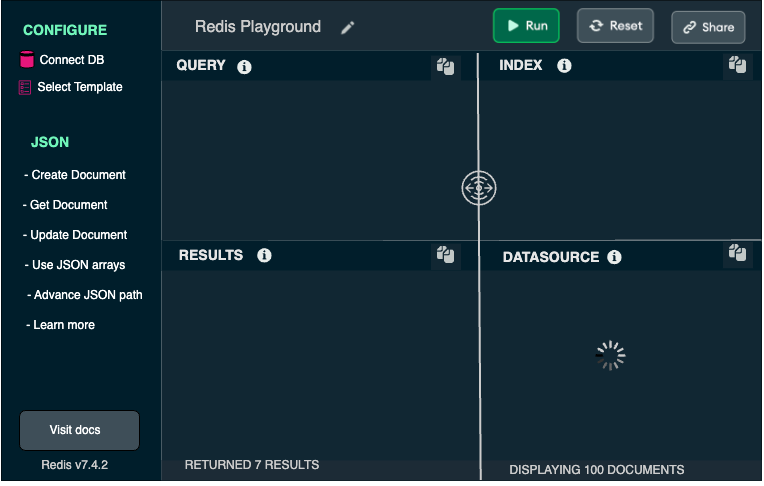

## Rough Design



- Make headers multi tab (in future to display more info like theoretical explanation)

## Backend

### Folder Structure

- `src/`
  - `data/`
    - `indexes/` -> `ecommerce-search-index.ts`
    - `data-sources/` -> `ecommerce-data-source.ts`
    - `queries/` -> `exact-match-query.ts`, ...etc

```ts
//sample query export
export const queryViewData = {
  queryId: "EXACT_MATCH_NUMERIC_QUERY",
  defaultQuery: `FT.SEARCH idx:bicycle "@price:[270 270]"`,
  //defaultQueryResult: "",
  indexId: "", // to get view data
  dataSourceId: "", // to get view data
};
```

Note :

- Each folder to have `index.ts` file which exports folder data with IDs
- Any new data in these folders should auto work with application. (Eg: queries are grouped in index.ts file only to prevent any UI changes)

### APIs

- `GET /api/getQueryNavbarData` -> (done)
- `GET /api/getQueryDataById` -> (done)
- `GET /api/getSampleDataByDataSourceId` ->(done)(Also cache in frontend to prevent extra calls)
- `GET /api/getDbIndexById` ->(done) (Also cache)

- `POST /api/runQuery` : (done)

  - (If query is same as default query, then use default query result to prevent API call)
  - Safe guards to prevent dangerous queries (Eg: `DEL *`)

  ```json
  {
    "customQuery": "",
    "queryId": "EXACT_MATCH_NUMERIC_QUERY"
    //"indexId": "",
    //"dataSourceId": ""
  }
  ```

  Note: show result from db only, as they may have changed data manually

- `POST /api/saveQuery` : For sharing functionality

### Internal APIs

- `POST /api/loadDataSourceInRedis`
- `POST /api/loadIndexInRedis`
- `POST /api/prepareFullDatabase` : To load all data sources and indexes in redis for faster access (useful for hosted version)

Note : have prefix to entire data, indexes, saved queries to prevent any conflict with existing database data. (Say playground `pg` prefix)
