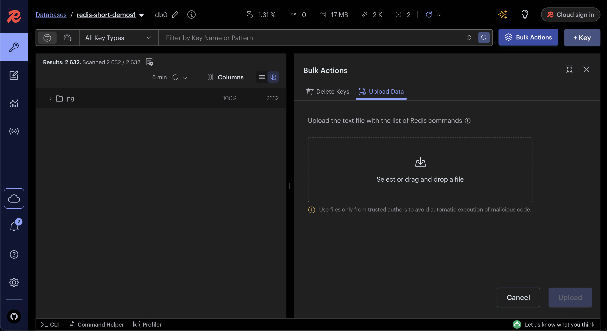
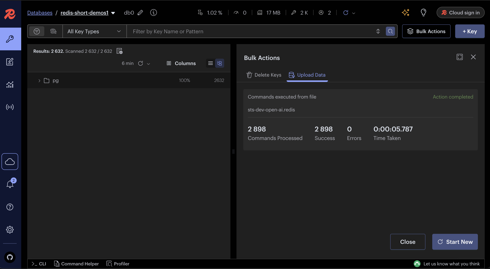
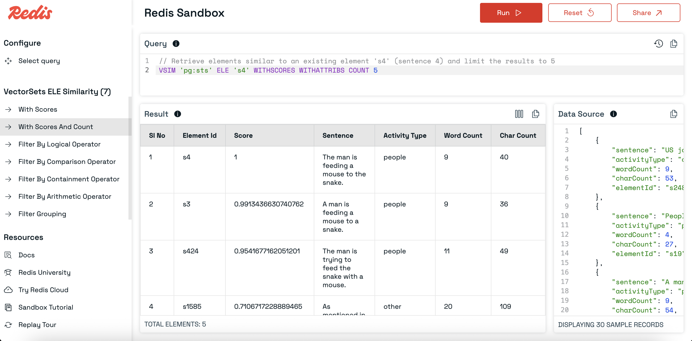
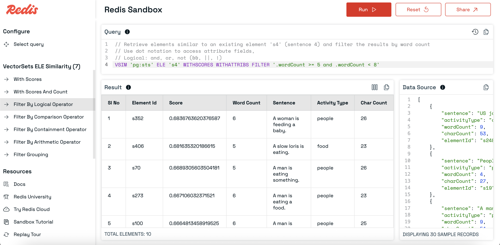
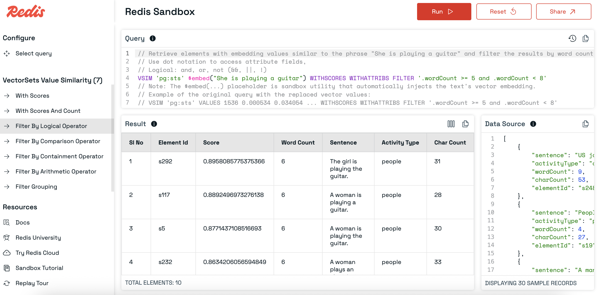
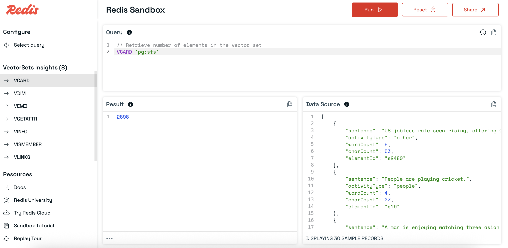

# Getting Started with Vector Sets

## What are Vector Sets?

Vector Sets are a Redis data type similar to Sorted Sets.  
However, instead of associating each element with a numerical score, elements in a Vector Set are associated with a **vector**—a list of floating-point numbers representing the item in a multi-dimensional space.

This makes Vector Sets ideal for **similarity search** tasks such as:

- Retrieving the most similar items to the **vector of an existing element** already in the set.
- Retrieving the most similar items to a **specified vector** (e.g., a new embedding not yet in the set).

With these capabilities, Vector Sets are useful in semantic search, recommendation systems, face recognition, and other applications where vector similarity is important.

**Visual Representation**

A Vector Set is a collection of elements, each associated with a vector and optional custom attributes.

```
Vector Set: "pg:sts"
├── Element ID: "s1"
│     ├── Vector: [-0.010130, -0.026101, …] (1536 dimensions)
│     └── Attributes:
│          {
│            "sentence": "A young child is riding a horse.",
│            "activityType": "people",
│            "wordCount": 7,
│            "charCount": 32
│          }
├── Element ID: "s2"
│     ├── Vector: [-0.011102, -0.034598, …]
│     └── Attributes: {...}
└── …
```

In this representation:

- **Vector Set key** → `"pg:sts"`
- **Element IDs** → Sentences identified by `"s1"`, `"s2"`, etc., each storing a vector and custom attributes required for future filtering or inspection.

## Adding Items to a Vector Set

You can add items to a Vector Set using the [VADD](https://redis.io/docs/latest/commands/vadd/) command.

### VADD

```sh
# Syntax
VADD {vectorSetKey} VALUES {embeddingDimension} {embeddingValues...} {elementId} SETATTR {elementAttributesAsJSON}
```

**Parameters:**

- {vectorSetKey} – The name of your Vector Set.
- {embeddingDimension} – The length of the vector (number of dimensions).
- {embeddingValues...} – The vector values (space-separated floats).
- {elementId} – A unique identifier for this element in the set.
- {elementAttributesAsJSON} – A JSON object containing any metadata about the element, making it easy to filter or inspect later.

```sh
# Example
VADD "pg:sts" VALUES 1536 -0.010130 -0.026101 ... "s1" SETATTR '{"sentence":"A young child is riding a horse.","activityType":"people","wordCount":7,"charCount":32}'
```

### Bulk Data Import (Optional)

The full **Semantic Textual Similarity (STS) Development Set** used in this tutorial is [available here](https://github.com/redis-developer/redis-datasets/blob/master/core/vectorsets/sts-dev-ds/sts-dev-open-ai.redis).

Upload that file into [Redis Insight](https://redis.io/insight/):

- Click `Bulk Actions` -> choose `Upload Data` tab -> Upload the file and click `Upload`



- Post upload, you can see the status of the upload data



## Similarity Search with Existing Elements

The [VSIM](https://redis.io/docs/latest/commands/vsim/) command allows you to find elements in a Vector Set that are most similar to the vector of an **existing element** in the same set.

This is useful when you already have an element in your dataset and want to find others that are semantically or visually close to it.

### VSIM

```sh
VSIM {vectorSetKey} ELE {elementId} WITHSCORES WITHATTRIBS
```

**Parameters:**

- {vectorSetKey} – The name of your Vector Set.
- ELE {elementId} – The ID of the element whose vector you want to use for similarity search.
- WITHSCORES – Returns the similarity score for each result.
- WITHATTRIBS – Returns the stored attributes (metadata) for each result.

**Example**

```sh
# Retrieve elements similar to existing element 's4' (Sentence 4)
VSIM "pg:sts" ELE "s4" WITHSCORES WITHATTRIBS COUNT 5
```

**Output:**

```json
[
  "s4",
  "1",
  "{\"sentence\":\"The man is feeding a mouse to the snake.\",\"activityType\":\"people\",\"wordCount\":9,\"charCount\":40}",
  "s3",
  "0.9913436630740762",
  "{\"sentence\":\"A man is feeding a mouse to a snake.\",\"activityType\":\"people\",\"wordCount\":9,\"charCount\":36}",
  "s424",
  "0.9541677162051201",
  "{\"sentence\":\"The man is trying to feed the snake with a mouse.\",\"activityType\":\"people\",\"wordCount\":11,\"charCount\":49}",
  "s1585",
  "0.7106717228889465",
  "{\"sentence\":\"As mentioned in previous answers, rats and gerbils can be offered instead of mice or in a rotation with mice.\",\"activityType\":\"other\",\"wordCount\":20,\"charCount\":109}",
  "s431",
  "0.6881625354290009",
  "{\"sentence\":\"The cat tried to eat the corn on the cob.\",\"activityType\":\"animals\",\"wordCount\":10,\"charCount\":41}"
]
```

**Visual Representation:**

```
Query: "Find items similar to element 's4'"

pg:sts
 ├── s4  (query element)
 │     Vector: [...]
 │     Attributes: { "sentence": "The man is feeding a mouse to the snake.", ... }
 │
 ├── s3  (score: 0.9913)  → "A man is feeding a mouse to a snake."
 ├── s424 (score: 0.9541) → "The man is trying to feed the snake with a mouse."
 ├── s1585 (score: 0.7106) → "Rats and gerbils can be offered instead of mice..."
 └── s431  (score: 0.6881) → "The cat tried to eat the corn on the cob."
```

### Try in Redis Sandbox

You can experiment with [Element Similarity queries](https://redis.io/try/sandbox?queryId=VECTOR_SETS_ELE_SIMILARITY_WITH_SCORES&catId=VECTOR_SETS_ELE_SIMILARITY) in the Redis Sandbox:

- Element similarity with scores and count example
  

- Element similarity with logical filter
  

Tip: In the Redis Sandbox, explore additional filter options in the left sidebar, including arithmetic filters, comparison filters, and containment filters.

## Similarity Search with Specified Vectors

The [VSIM](https://redis.io/docs/latest/commands/vsim/) command can also search for elements similar to a **vector you provide directly**, instead of using an existing element’s vector.

This is useful when:

- You have a **new piece of text, image, or audio** not in your dataset.
- You have already generated its vector embeddings using the **same model and dimensions** used when seeding the Vector Set.

### VSIM

```sh
VSIM {vectorSetKey} VALUES {embeddingDimension} {embeddingValues...} WITHSCORES WITHATTRIBS
```

Where:

- {vectorSetKey} – The name of your Vector Set.
- VALUES {embeddingDimension} {embeddingValues...} – The embedding vector to compare against.
- WITHSCORES – Returns the similarity score for each result.
- WITHATTRIBS – Returns the stored attributes (metadata) for each result.
- COUNT N (optional) – Limits the number of results returned.

**Example**

```sh
# Retrieve the top 5 elements similar to the phrase "She is playing a guitar"
VSIM "pg:sts" VALUES 1536 0.000534 0.034054 ... WITHSCORES WITHATTRIBS COUNT 5
```

Note:

- Before running this query, convert your search text into vector embeddings using the same model (and dimensionality) as the one used to seed the dataset.
  For example, if the dataset was built using OpenAI’s text-embedding-ada-002 model (1536 dimensions), use the same for the query.

```sh
# Output
[
  "s292",
  "0.8956013321876526",
  "{\"sentence\":\"The girl is playing the guitar.\",\"activityType\":\"people\",\"wordCount\":6,\"charCount\":31}",
  "s117",
  "0.8890393897891045",
  "{\"sentence\":\"A woman is playing a guitar.\",\"activityType\":\"people\",\"wordCount\":6,\"charCount\":28}",
  "s5",
  "0.8769233152270317",
  "{\"sentence\":\"A woman is playing the guitar.\",\"activityType\":\"people\",\"wordCount\":6,\"charCount\":30}",
  "s232",
  "0.863240122795105",
  "{\"sentence\":\"A woman plays an electric guitar.\",\"activityType\":\"people\",\"wordCount\":6,\"charCount\":33}",
  "s271",
  "0.8623353093862534",
  "{\"sentence\":\"A person is playing a guitar.\",\"activityType\":\"people\",\"wordCount\":6,\"charCount\":29}"
]
```

**Visual Representation**

```
Query Vector: [0.000534, 0.034054, ...]  (1536 dimensions)
Phrase: "She is playing a guitar"

pg:sts
 ├── s292  (score: 0.8956) → "The girl is playing the guitar."
 ├── s117  (score: 0.8890) → "A woman is playing a guitar."
 ├── s5    (score: 0.8769) → "A woman is playing the guitar."
 ├── s232  (score: 0.8632) → "A woman plays an electric guitar."
 └── s271  (score: 0.8623) → "A person is playing a guitar."
```

### Try in Redis Sandbox

Experiment with [Value Similarity queries](https://redis.io/try/sandbox?queryId=VECTOR_SETS_VALUE_SIMILARITY_WITH_SCORES&catId=VECTOR_SETS_VALUE_SIMILARITY) in the Redis Sandbox:

Value similarity with scores and count example


Value similarity with logical filter


Tip: In the Redis Sandbox, explore additional filter options in the left sidebar, including arithmetic filters, comparison filters, and containment filters.

## Other Vector Set Commands

Vector Sets in Redis support several utility commands that let you inspect, debug, and retrieve metadata, attributes, or structure-related information.

- `VCARD` – Count elements.
- `VDIM` – Get vector dimensions.
- `VEMB` – Get vector for an element.
- `VGETATTR` – Get attributes for an element.
- `VINFO` – Get metadata about the Vector Set.
- `VISMEMBER` – Check if an element exists.
- `VLINKS` – Get neighbors in the HNSW graph.
- `VRANDMEMBER` – Get random elements.

### Commands

**VCARD**

```sh
#  Retrieve number of elements in the Vector Set
VCARD 'pg:sts'
```

```sh
# Output
2898
```

**VDIM**

```sh
# Retrieve number of dimensions of the vectors in the Vector Set
VDIM 'pg:sts'
```

```sh
# Output
1536
```

**VEMB**

```sh
#  Retrieve the approximate vector associated with a given element in the Vector Set.
VEMB 'pg:sts' 's4'
```

```sh
# output
[
    -0.000534,
    -0.034054,
    ...
]
```

**VGETATTR**

```sh
# Retrieve the JSON attributes associated with an element in a Vector Set.
VGETATTR 'pg:sts' 's4'
```

```json
//output
{
  "sentence": "The man is feeding a mouse to the snake.",
  "activityType": "people",
  "wordCount": 9,
  "charCount": 40
}
```

**VINFO**

```sh
# Retrieve metadata and internal details about a Vector Set, including size, dimensions, quantization type, and graph structure.
VINFO 'pg:sts'
```

```sh
# output
[
    "quant-type",
    "int8",
    "hnsw-m",
    16,
    "vector-dim",
    1536,
    "projection-input-dim",
    0,
    "size",
    2898,
    "max-level",
    5,
    "attributes-count",
    2898,
    "vset-uid",
    1,
    "hnsw-max-node-uid",
    2898
]
```

**VISMEMBER**

```sh
# Check if an element exists in a Vector Set.
VISMEMBER 'pg:sts' 's4'
```

```sh
# Output
1
```

**VLINKS**

```sh
# Retrieve the neighbors of a specified element in a Vector Set. The command shows the connections for each layer of the HNSW graph.
VLINKS 'pg:sts' 's4' WITHSCORES
```

```sh
# Output
[
    [
        "s3",
        "0.9913524389266968",
        "s48",
        "0.6641438603401184",
        "s41",
        "0.6403481364250183",
        "s143",
        "0.6444393396377563",
        "s313",
        "0.6643930673599243",
        "s49",
        "0.6708853244781494",
        "s88",
        "0.6295275092124939",
        "s151",
        "0.6321077346801758",
        "s22",
        "0.6504884958267212",
        "s23",
        "0.6327859163284302",
        "s424",
        "0.9541758298873901",
        "s234",
        "0.6351098418235779",
        "s223",
        "0.6552782654762268",
        "s32",
        "0.6151469349861145",
        "s33",
        "0.660621166229248",
        "s34",
        "0.6514499187469482",
        "s144",
        "0.6475448608398438",
        "s69",
        "0.664794921875",
        "s70",
        "0.6689335703849792",
        "s87",
        "0.6211662292480469",
        "s100",
        "0.6664842963218689",
        "s118",
        "0.6297042369842529",
        "s180",
        "0.6260825395584106",
        "s184",
        "0.6349957585334778",
        "s205",
        "0.6521439552307129",
        "s314",
        "0.6671926975250244",
        "s317",
        "0.6466522216796875",
        "s405",
        "0.6673968434333801",
        "s406",
        "0.6816385984420776",
        "s936",
        "0.6363080739974976",
        "s1142",
        "0.6250642538070679",
        "s1503",
        "0.6684114933013916"
    ]
]
```

**VRANDMEMBER**

```sh
# Retrieve one or more random elements from a Vector Set.
VRANDMEMBER 'pg:sts' 5
```

```sh
# Output
[
    "s2602",
    "s989",
    "s409",
    "s349",
    "s547"
]
```

### Try in Redis Sandbox

Experiment with [other Vector Set commands](https://redis.io/try/sandbox?queryId=VECTOR_SETS_INSIGHTS_VCARD&catId=VECTOR_SETS_INSIGHTS) in the Redis Sandbox:



Tip: In the Sandbox, you can select a command from the left sidebar, click the Run button, and instantly see the output.

## Ready to Use Vector Sets?

You’ve learned how to:

- Add elements to a Vector Set.
- Run similarity searches using existing or custom vectors.
- Use other utility commands to inspect and explore your data.

Vector Sets provide fast, scalable similarity search in Redis — perfect for semantic search, recommendations, and AI-powered retrieval.

**Next Steps:**

- Try the Redis Sandbox links in this guide.
- Import your own data and test queries.
- Explore full docs: [Vector Sets data type](https://redis.io/docs/latest/develop/data-types/vector-sets/)
